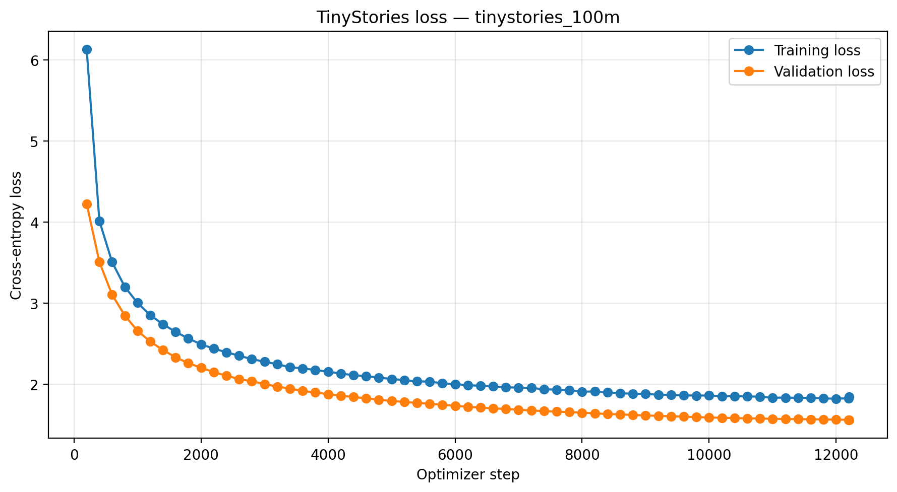

# TinyStories GPT — A 29.4M-Parameter Language Model Trained From Scratch

[](https://www.python.org/)
[](https://pytorch.org/)
[](LICENSE)
[](https://huggingface.co/datasets/roneneldan/TinyStories)

A compact decoder-only Transformer implemented and trained from scratch in PyTorch on **100 million TinyStories tokens** using a single **NVIDIA GeForce RTX 3050 Laptop GPU with 6 GB VRAM**.

The project was built as an educational implementation of the core components used in GPT-style language models: byte-level BPE tokenization, causal multi-head self-attention, learned positional embeddings, pre-normalized Transformer blocks, next-token prediction, mixed-precision training, gradient accumulation, validation monitoring, checkpoint recovery, and autoregressive text generation.

The repository now keeps the complete 100M-token implementation in `tiny_stories_100m/`, the earlier learning experiments in `Simple Implementation Files/`, and the rendered training and saved-model notebooks at the repository root for immediate inspection on GitHub.

> [!IMPORTANT]
> This is a small research and educational model, not a production assistant. It has not undergone alignment training, red-teaming, memorization testing, privacy auditing, or comprehensive safety evaluation.

---

## Table of contents

- [Project summary](#project-summary)
- [Results](#results)
- [Understanding the metrics](#understanding-the-metrics)
- [Architecture](#architecture)
- [Architectural decisions](#architectural-decisions)
- [Tokenizer](#tokenizer)
- [Dataset and preprocessing](#dataset-and-preprocessing)
- [Training configuration](#training-configuration)
- [Repository structure](#repository-structure)
- [Installation](#installation)
- [Reproducing the experiment](#reproducing-the-experiment)
- [Loading the trained model](#loading-the-trained-model)
- [Evaluating the model](#evaluating-the-model)
- [Generated examples](#generated-examples)
- [Limitations](#limitations)
- [Responsible use and safety](#responsible-use-and-safety)
- [Dataset license and attribution](#dataset-license-and-attribution)
- [Code, weights, and third-party licenses](#code-weights-and-third-party-licenses)
- [Legal disclaimer](#legal-disclaimer)
- [Citation](#citation)
- [Author](#author)

---

## Project summary

| Item | Value |
|---|---:|
| Model type | Decoder-only causal Transformer |
| Trainable parameters | **29,434,880** |
| Transformer blocks | 8 |
| Embedding width | 512 |
| Attention heads | 8 |
| Dimension per head | 64 |
| Feed-forward width | 2,048 |
| Context length | 256 tokens |
| Tokenizer | Byte-level BPE |
| Vocabulary size | 8,000 |
| Training token budget | 100,000,000 |
| Tokens actually optimized | 99,999,744 |
| Validation token file | 1,000,000 tokens |
| Effective batch size | 8,192 tokens/update |
| Optimizer steps | 12,207 |
| Training hardware | RTX 3050 Laptop GPU, 6 GB VRAM |
| Host memory | 32 GB DDR4 |
| CPU | 13th-generation Intel Core i5 |
| Recorded training time | **1.41 hours** |
| Approximate end-to-end throughput | **19.7K tokens/second** |
| Best periodic validation loss | **1.5643** |
| Corresponding periodic perplexity | **4.78** |
| Inference artifact size | 112.3 MiB |
| Random-model smoke-test loss | 9.0670 |

The throughput above is calculated from `99,999,744 tokens / 1.41 hours`, so it includes the overhead of periodic validation and checkpointing.

---

## Results

The model learned continuously throughout the 100M-token run. Training and validation loss both decreased, and validation loss did not reverse upward near the end of the experiment.



The complete recorded history is available in:

```text
outputs/tinystories_100m_training_history.json
```

Selected checkpoints from the run:

| Optimizer step | Tokens seen | Training loss | Validation loss | Learning rate |
|---:|---:|---:|---:|---:|
| 200 | 1,638,400 | 6.1291 | 4.2275 | 1.65e-4 |
| 3,000 | 24,576,000 | 2.2815 | 2.0053 | 2.68e-4 |
| 6,000 | 49,152,000 | 2.0055 | 1.7382 | 1.75e-4 |
| 9,000 | 73,728,000 | 1.8823 | 1.6177 | 7.60e-5 |
| 12,000 | 98,304,000 | 1.8249 | 1.5664 | 3.02e-5 |
| 12,207 | 99,999,744 | 1.8510 | **1.5643** | 3.00e-5 |

### Scope of the reported validation metric

Periodic validation evaluated a fixed subset of:

```text
200 batches × 2 sequences/batch × 256 tokens/sequence
= 102,400 validation tokens
```

Therefore, **1.5643 is a periodic evaluation-slice result**, not yet a claim about the complete 1M-token validation file. A full-validation command is provided in [Evaluating the model](#evaluating-the-model). Replace the reported headline metric with the full-validation result after running it.

### Was the model overfitting?

No clear overfitting was observed in this run:

- training loss decreased;
- validation loss also decreased;
- validation loss continued improving through the final evaluation;
- there was no sustained validation-loss increase while training loss continued falling.

Training loss is higher than validation loss because they are measured under different conditions:

- training loss is recorded with dropout enabled;
- validation loss is measured in `model.eval()` with dropout disabled;
- training loss is averaged over recent training updates;
- validation loss is averaged over a fixed held-out evaluation slice.

The two curves are useful for trends, but they are not perfectly identical measurements.

---

## Understanding the metrics

### Cross-entropy loss

The model is trained to predict the next token. For each position, cross-entropy measures how much probability the model assigned to the correct next token.

Lower is better:

- a high loss means the model is uncertain or confidently wrong;
- a falling loss means the model is assigning more probability to correct next tokens;
- a rising validation loss alongside a falling training loss can indicate overfitting.

For a uniform random predictor over an 8,000-token vocabulary, the expected loss is approximately:

```text
ln(8,000) ≈ 8.99
```

The untrained smoke-test loss was `9.0670`, which is close to the expected random baseline.

### Perplexity

Perplexity is calculated as:

```text
perplexity = exp(cross_entropy_loss)
```

For the best periodic validation loss:

```text
exp(1.5643) ≈ 4.78
```

This does **not** mean the model literally chooses among exactly 4.78 words. It is an interpretable transformation of average token-level uncertainty. Perplexity values should only be compared when the tokenization, dataset, and evaluation procedure are the same.

### Generated-text quality

Loss alone does not fully measure story quality. The project also evaluates:

- grammar;
- prompt adherence;
- character consistency;
- event ordering;
- repetition;
- whether the story reaches a plausible ending.

Generation is stochastic when temperature sampling is enabled, so multiple prompts and random seeds should be inspected.

---

## Architecture

The model is a GPT-style decoder-only Transformer.

```text
Token IDs
   │
   ├── Token embeddings
   ├── Learned positional embeddings
   │
   ▼
Embedding dropout
   │
   ▼
8 × Transformer blocks
   ├── LayerNorm
   ├── Causal multi-head self-attention
   ├── Residual connection
   ├── LayerNorm
   ├── 4× feed-forward network with GELU
   └── Residual connection
   │
   ▼
Final LayerNorm
   │
   ▼
Tied output projection
   │
   ▼
Next-token logits over 8,000 tokens
```

### Model configuration

```python
TINYSTORIES_CONFIG_29M = {
    "vocab_size": 8_000,
    "context_length": 256,
    "emb_dim": 512,
    "n_heads": 8,
    "n_layers": 8,
    "drop_rate": 0.1,
    "qkv_bias": False,
}
```

### Parameter breakdown

| Component | Parameters |
|---|---:|
| Tied token embedding/output matrix | 4,096,000 |
| Learned positional embeddings | 131,072 |
| Eight Transformer blocks | 25,206,784 |
| Final LayerNorm | 1,024 |
| **Total** | **29,434,880** |

---

## Architectural decisions

### 8,000-token byte-level BPE vocabulary

GPT-2's original tokenizer contains more than 50,000 tokens. That would dedicate a large portion of a small model to the embedding and output matrices.

An 8,000-token vocabulary was chosen because TinyStories uses relatively simple English. This reduces:

- embedding parameters;
- output-projection computation;
- memory consumption;
- training time.

Byte-level preprocessing also allows arbitrary text to be represented using byte-level components, while BPE merges common patterns into efficient word or subword tokens.

### Weight tying

The input token embedding and output projection use the same parameter matrix:

```python
self.out_head.weight = self.tok_emb.weight
```

Without weight tying, an additional:

```text
8,000 × 512 = 4,096,000
```

parameters would be required. Weight tying reduced the model from approximately 33.5M to **29.4M parameters**.

### Context length of 256

A 256-token context was selected as a balance between:

- sufficient context for short stories;
- attention cost;
- activation memory;
- the 6 GB VRAM limit.

During generation, the model uses a sliding context window and retains only the most recent 256 tokens.

### Pre-normalized residual blocks

Layer normalization is applied before attention and before the feed-forward network. Pre-normalization generally provides stable gradient flow for decoder-only Transformers.

### PyTorch scaled dot-product attention

Attention uses:

```python
torch.nn.functional.scaled_dot_product_attention(
    queries,
    keys,
    values,
    is_causal=True,
)
```

This avoids a handwritten attention-score pipeline and allows PyTorch to select an optimized attention backend when supported by the device and tensor layout.

### Four-times expansion in the feed-forward network

Each block expands token representations from 512 to 2,048 dimensions, applies GELU, and projects back to 512 dimensions:

```text
512 → 2,048 → 512
```

### Learned positional embeddings

The model uses a learned embedding for each position from 0 to 255. It does not use rotary embeddings, ALiBi, or sinusoidal positions.

---

## Tokenizer

The tokenizer is trained with Hugging Face `tokenizers` using byte-level BPE.

Tokenizer training configuration:

| Setting | Value |
|---|---:|
| Training stories used | 200,000 |
| Vocabulary size | 8,000 |
| Minimum merge frequency | 2 |
| Tokenizer batch size | 1,000 stories |
| Unknown token | `<|unk|>` |
| End-of-story token | `<|endoftext|>` |
| UNK ID | 0 |
| EOS ID | 1 |

Example:

```text
Text:
Once upon a time, a little dragon found a red ball.

Tokens:
['Once', 'Ġupon', 'Ġa', 'Ġtime', ',', 'Ġa', 'Ġlittle',
 'Ġdragon', 'Ġfound', 'Ġa', 'Ġred', 'Ġball', '.']
```

`Ġ` represents a leading space in byte-level BPE token display. It is decoded back into an ordinary space.

The saved tokenizer is:

```text
tinystories_tokenizer.json
```

> [!WARNING]
> Retraining or replacing the tokenizer changes token IDs. Existing `.bin` token files and model checkpoints are only compatible with the tokenizer used to create them.

---

## Dataset and preprocessing

The project uses the [TinyStories dataset](https://huggingface.co/datasets/roneneldan/TinyStories), introduced by Ronen Eldan and Yuanzhi Li.

TinyStories contains synthetic short stories generated with GPT-3.5 and GPT-4 using a deliberately simple vocabulary. The dataset is designed for studying language generation in small models.

### Preprocessing pipeline

1. Load the TinyStories training or validation split with Hugging Face Datasets.
2. Reuse the local Arrow cache when available.
3. Shuffle the training examples using a fixed seed.
4. Encode each story with the custom 8K tokenizer.
5. Append `<|endoftext|>` after every story.
6. Write one flat stream of token IDs.
7. Store IDs as `uint16`.
8. Memory-map the binary file during training.
9. Construct 256-token inputs and one-token-shifted targets dynamically.

Example:

```text
Input:  [Once, upon, a, time, ...]
Target: [upon, a, time, there, ...]
```

### Why `uint16`?

The vocabulary contains only 8,000 IDs, so every ID fits within an unsigned 16-bit integer.

A 100M-token file therefore requires approximately:

```text
100,000,000 × 2 bytes = 200 MB
```

instead of approximately 800 MB with `int64` storage.

The data loader converts each selected window to `torch.long` immediately before it is passed to `nn.Embedding`.

### Data not included in this repository

This repository should not redistribute:

- TinyStories raw text;
- Hugging Face Arrow cache files;
- generated `.bin` token streams;
- Hugging Face cache directories.

Recommended `.gitignore` entries:

```gitignore
data/*.bin
checkpoints/**/*.pt
tiny_stories_100m/data/*.bin
tiny_stories_100m/checkpoints/**/*.pt
.cache/
__pycache__/
.ipynb_checkpoints/
```

Users obtain the dataset from its original host under its original license.

---

## Training configuration

| Hyperparameter | Value |
|---|---:|
| Training tokens | 100,000,000 |
| Validation tokens stored | 1,000,000 |
| Micro-batch size | 2 |
| Context length | 256 |
| Gradient accumulation | 16 |
| Effective tokens/update | 8,192 |
| Optimizer steps | 12,207 |
| Optimizer | AdamW |
| Peak learning rate | 3e-4 |
| Adam betas | (0.9, 0.95) |
| Adam epsilon | 1e-8 |
| Weight decay | 0.1 |
| Warmup steps | 366 |
| Warmup fraction | approximately 3% |
| LR decay | cosine |
| Final/minimum LR ratio | 0.1 |
| Gradient clipping | 1.0 |
| Dropout | 0.1 |
| Precision | FP16 automatic mixed precision on CUDA |
| Evaluation frequency | every 200 optimizer steps |
| Periodic evaluation batches | 200 |
| Checkpoint frequency | every 1,000 optimizer steps |
| Seed | 42 |

Biases and one-dimensional normalization parameters are excluded from weight decay.

### Checkpoint strategy

The training loop saves:

```text
checkpoints/tinystories_100m/best.pt
checkpoints/tinystories_100m/latest.pt
```

- `best.pt` is updated whenever periodic validation loss improves.
- `latest.pt` stores the most recent resumable state.
- the optimizer, AMP scaler, scheduler, token count, history, and best loss are stored for resuming;
- standalone step checkpoints are disabled by default to save disk space.

### Reproducibility caveat

Python, NumPy, and PyTorch seeds are set to 42. Exact bit-for-bit reproducibility is not guaranteed across different:

- GPUs;
- CUDA versions;
- PyTorch versions;
- attention kernels;
- operating systems.

---

## Repository structure

The repository separates the original learning implementation from the complete 100M-token TinyStories experiment.

```text
Transformer/
├── Simple Implementation Files/
│   └── earlier attention, tokenizer, dataset, and GPT experiments
│
├── tiny_stories_100m/
│   ├── dataSet.py
│   │   ├── memory-mapped token dataset
│   │   └── PyTorch DataLoader construction
│   │
│   ├── gptModel.py
│   │   ├── 29.4M-parameter model configuration
│   │   ├── feed-forward network
│   │   ├── Transformer blocks
│   │   ├── GPT model
│   │   └── generation/token conversion helpers
│   │
│   ├── multiheadedattention.py
│   │   └── causal multi-head self-attention using PyTorch SDPA
│   │
│   ├── processData.py
│   │   └── TinyStories loading, tokenization, EOS insertion, and binary writing
│   │
│   ├── train_model.py
│   │   ├── validation
│   │   ├── AdamW parameter grouping
│   │   ├── warmup/cosine scheduling
│   │   ├── mixed-precision training
│   │   └── checkpoint save/resume
│   │
│   ├── train_tokenizer.py
│   │   └── byte-level BPE tokenizer training
│   │
│   ├── tinystories_tokenizer.json
│   │   └── tokenizer copy used by the self-contained implementation
│   │
│   ├── train_model.ipynb
│   │   └── runnable copy of the complete training workflow
│   │
│   └── SavedModelExperiments.ipynb
│       └── runnable copy of the checkpoint-loading and generation workflow
│
├── outputs/
│   ├── tinystories_100m_training_history.json
│   ├── tinystories_100m_loss_curve.png
│   ├── tinystories_100m_generated_samples.json
│   └── tinystories_100m_best_model.pt
│
├── train_model.ipynb
│   └── rendered record of preprocessing, validation, and the 100M-token run
│
├── SavedModelExperiments.ipynb
│   └── rendered record of loading the trained model and sampling stories
│
├── tinystories_tokenizer.json
├── README.md
├── LICENSE
├── NOTICE
├── RESPONSIBLE_USE.md
├── THIRD_PARTY_NOTICES.md
└── .gitignore
```

### Why the notebooks appear twice

The two root notebooks are intentionally kept at the top level so GitHub visitors can immediately inspect the recorded outputs, loss values, plots, and generations.

Copies inside `tiny_stories_100m/` keep the complete implementation together for users who clone the repository and want to run the experiment. When either notebook is changed, both copies should be updated in the same commit so they do not drift apart.

### Import behavior

The root notebooks import modules through the implementation folder, for example:

```python
from tiny_stories_100m.dataSet import create_dataloader
from tiny_stories_100m.gptModel import GPTModel
from tiny_stories_100m.train_model import train_model
```

Some implementation modules retain ordinary sibling imports such as:

```python
import multiheadedattention
```

instead of package-relative imports. To keep those imports working from a clean clone, the notebooks should add the implementation directory to `sys.path` before importing project modules:

```python
from pathlib import Path
import sys

REPO_ROOT = Path.cwd()
IMPLEMENTATION_DIR = REPO_ROOT / "tiny_stories_100m"

if str(IMPLEMENTATION_DIR) not in sys.path:
    sys.path.insert(0, str(IMPLEMENTATION_DIR))
```

This bootstrap allows both the package-style notebook imports and the existing sibling imports inside the implementation files to resolve. Without it, a fresh Python process may fail to find `multiheadedattention.py` even though the file is in the same folder as `gptModel.py`.

### Case-sensitive file names

The project currently uses the filename `dataSet.py`. File names and imports are case-sensitive on Linux, so this must match exactly:

```python
from tiny_stories_100m.dataSet import create_dataloader
```

Renaming it to `dataset.py` is optional, but all imports and notebook references must then be updated together.

---

## Installation

### 1. Clone the repository

```bash
git clone https://github.com/abhizz11/Transformer.git
cd Transformer
```

Cloning downloads the implementation folders, root notebooks, tokenizer, saved outputs, README, and notice files that are tracked by Git. Large ignored files such as local Hugging Face caches, generated token binaries, and training checkpoints are not downloaded.

### 2. Create a virtual environment

Windows:

```powershell
py -m venv .venv
.venv\Scripts\activate
```

Linux/macOS:

```bash
python3 -m venv .venv
source .venv/bin/activate
```

### 3. Install dependencies

Install a CUDA-enabled PyTorch build that matches your system from the official PyTorch installation instructions. Then install the remaining packages:

```bash
pip install datasets tokenizers numpy matplotlib tqdm jupyter
```

The recorded experiment used:

```text
Python 3.13
PyTorch 2.12.0+cu126
NVIDIA GeForce RTX 3050 Laptop GPU with 6 GB VRAM
```

Different PyTorch, CUDA, GPU, and operating-system versions can produce different performance and slightly different numerical results.

### 4. Start Jupyter from the repository root

```bash
jupyter notebook
```

Open either root notebook:

```text
train_model.ipynb
SavedModelExperiments.ipynb
```

The root notebooks are the easiest versions to inspect on GitHub. Their matching copies inside `tiny_stories_100m/` keep the experiment next to its modules.

### 5. Confirm the repository root

The notebook expects its working directory to be the cloned repository root:

```python
from pathlib import Path

REPO_ROOT = Path.cwd()
assert (REPO_ROOT / "tiny_stories_100m").exists()
assert (REPO_ROOT / "outputs").exists()
```

Before importing the model modules, add the implementation directory to the Python search path:

```python
import sys

IMPLEMENTATION_DIR = REPO_ROOT / "tiny_stories_100m"

if str(IMPLEMENTATION_DIR) not in sys.path:
    sys.path.insert(0, str(IMPLEMENTATION_DIR))
```

Then import the implementation:

```python
from tiny_stories_100m.dataSet import create_dataloader
from tiny_stories_100m.gptModel import (
    GPTModel,
    TINYSTORIES_CONFIG_29M,
    generate,
    text_to_token_ids,
    token_ids_to_text,
)
from tiny_stories_100m.processData import tokenize_split
from tiny_stories_100m.train_model import (
    build_optimizer,
    build_warmup_cosine_scheduler,
    evaluate_model,
    train_model,
)
```

---

## Reproducing the experiment

The training notebook at the repository root is the rendered experiment record. The copy inside `tiny_stories_100m/` contains the same workflow next to the source modules.

### Path configuration

Use repository-root-based paths rather than paths relative to a particular Python file:

```python
from pathlib import Path

REPO_ROOT = Path.cwd()
IMPLEMENTATION_DIR = REPO_ROOT / "tiny_stories_100m"
OUTPUT_DIR = REPO_ROOT / "outputs"
DATA_DIR = REPO_ROOT / "data"
CHECKPOINT_DIR = REPO_ROOT / "checkpoints"

TOKENIZER_PATH = REPO_ROOT / "tinystories_tokenizer.json"

OUTPUT_DIR.mkdir(parents=True, exist_ok=True)
DATA_DIR.mkdir(parents=True, exist_ok=True)
CHECKPOINT_DIR.mkdir(parents=True, exist_ok=True)
```

If the tokenizer is loaded from the copy inside the implementation folder instead, use:

```python
TOKENIZER_PATH = (
    REPO_ROOT
    / "tiny_stories_100m"
    / "tinystories_tokenizer.json"
)
```

Both tokenizer copies must remain byte-for-byte identical because tokenized data and checkpoints depend on the exact token-to-ID mapping.

### Quick smoke run

Before a long run, configure:

```python
QUICK_RUN = True
RESUME_FROM_LATEST = False
```

The quick mode checks:

- tokenizer compatibility;
- valid token ranges;
- exact encode/decode round trips;
- input/target shifting;
- logits shape;
- finite forward and backward loss;
- CUDA availability;
- checkpoint creation;
- validation;
- plotting;
- text generation.

### Full 100M-token run

Use:

```python
QUICK_RUN = False
RESUME_FROM_LATEST = False
```

The main configuration is:

```python
TRAIN_TOKEN_BUDGET = 100_000_000
VALIDATION_TOKEN_BUDGET = 1_000_000
EVAL_FREQUENCY = 200
EVAL_BATCHES = 200
CHECKPOINT_FREQUENCY = 1_000
```

Restart the notebook kernel before beginning a clean training run. This prevents an old model, optimizer, or loaded checkpoint from remaining in notebook memory.

### Resume an interrupted run

Use:

```python
QUICK_RUN = False
RESUME_FROM_LATEST = True
```

The training loop loads the latest resumable checkpoint from the configured checkpoint directory. A typical path is:

```text
checkpoints/tinystories_100m/latest.pt
```

Do not resume a run with a learning-rate scheduler configured for a different total number of optimizer steps unless that change is deliberate.

### Generated files

The training workflow creates local files such as:

```text
data/tinystories_train_100000000.bin
data/tinystories_validation_1000000.bin
checkpoints/tinystories_100m/best.pt
checkpoints/tinystories_100m/latest.pt
```

These large files should remain ignored by Git. The smaller final metrics, plots, and selected inference artifacts belong in the root `outputs/` folder.

---

## Loading the trained model

The root `SavedModelExperiments.ipynb` shows the saved-model workflow and its outputs. The implementation folder contains a second copy next to the source modules.

The lightweight inference artifact contains:

- the model state dictionary;
- model configuration;
- tokenizer filename;
- optimizer step;
- tokens seen;
- best recorded validation loss.

```python
from pathlib import Path
import sys

import torch
from tokenizers import Tokenizer

REPO_ROOT = Path.cwd()
IMPLEMENTATION_DIR = REPO_ROOT / "tiny_stories_100m"

if str(IMPLEMENTATION_DIR) not in sys.path:
    sys.path.insert(0, str(IMPLEMENTATION_DIR))

from tiny_stories_100m.gptModel import (
    GPTModel,
    generate,
    text_to_token_ids,
    token_ids_to_text,
)

device = torch.device(
    "cuda" if torch.cuda.is_available() else "cpu"
)

artifact_path = (
    REPO_ROOT
    / "outputs"
    / "tinystories_100m_best_model.pt"
)
tokenizer_path = (
    REPO_ROOT
    / "tinystories_tokenizer.json"
)

artifact = torch.load(
    artifact_path,
    map_location=device,
    weights_only=False,
)

tokenizer = Tokenizer.from_file(str(tokenizer_path))
eos_id = tokenizer.token_to_id("<|endoftext|>")

model = GPTModel(artifact["config"])
model.load_state_dict(artifact["model"], strict=True)
model = model.to(device)
model.eval()

prompt = "Once upon a time, there was a little dragon"
input_ids = text_to_token_ids(prompt, tokenizer).to(device)

torch.manual_seed(42)
if device.type == "cuda":
    torch.cuda.manual_seed_all(42)

output_ids = generate(
    model=model,
    idx=input_ids,
    max_new_tokens=180,
    context_size=artifact["config"]["context_length"],
    temperature=0.8,
    top_k=40,
    eos_id=eos_id,
)

print(
    token_ids_to_text(
        output_ids,
        tokenizer,
        skip_special_tokens=True,
    )
)
```

### Decoding controls

| Mode | Temperature | Top-k | Typical behavior |
|---|---:|---:|---|
| Greedy | 0.0 | None | deterministic, often repetitive |
| Balanced | 0.8 | 40 | recommended demonstration setting |
| Creative | 1.0 | 50 | more varied, more errors |

Generation settings affect token selection without changing model weights.

---

## Evaluating the model

The periodic training metric used 200 validation batches. To evaluate the best training checkpoint over the complete 1M-token validation file:

```python
import math
from pathlib import Path
import sys

import torch

REPO_ROOT = Path.cwd()
IMPLEMENTATION_DIR = REPO_ROOT / "tiny_stories_100m"

if str(IMPLEMENTATION_DIR) not in sys.path:
    sys.path.insert(0, str(IMPLEMENTATION_DIR))

from tiny_stories_100m.dataSet import create_dataloader
from tiny_stories_100m.gptModel import (
    GPTModel,
    TINYSTORIES_CONFIG_29M,
)
from tiny_stories_100m.train_model import evaluate_model

device = torch.device(
    "cuda" if torch.cuda.is_available() else "cpu"
)

checkpoint_path = (
    REPO_ROOT
    / "checkpoints"
    / "tinystories_100m"
    / "best.pt"
)
validation_file = (
    REPO_ROOT
    / "data"
    / "tinystories_validation_1000000.bin"
)

checkpoint = torch.load(
    checkpoint_path,
    map_location=device,
    weights_only=False,
)

model = GPTModel(TINYSTORIES_CONFIG_29M).to(device)
model.load_state_dict(checkpoint["model"], strict=True)
model.eval()

validation_loader = create_dataloader(
    token_file=validation_file,
    context_length=256,
    batch_size=2,
    shuffle=False,
    num_workers=0,
    pin_memory=device.type == "cuda",
    drop_last=False,
    seed=42,
)

full_validation_loss = evaluate_model(
    model=model,
    data_loader=validation_loader,
    device=device,
    max_batches=None,
)

print(f"Full validation loss: {full_validation_loss:.4f}")
print(
    "Full validation perplexity:",
    f"{math.exp(full_validation_loss):.2f}",
)
```

For meaningful comparisons, keep the following identical:

- tokenizer;
- validation token file;
- context length;
- selected checkpoint policy;
- evaluation precision;
- number of evaluated batches.

The root notebooks preserve the reported experiment outputs, while the implementation folder contains the code required to reproduce them.

---

## Generated examples

Generation settings:

```text
temperature = 0.8
top_k = 40
max_new_tokens = 180
```

### Prompt

```text
Once upon a time, there was a little dragon
```

### Sample output

> Once upon a time, there was a little dragon named Buzz. Buzz lived in a big forest with his friends. They all loved to play together.
>
> One day, Buzz and his friends were playing hide and seek. They found a big, shiny rock. They thought it was the best rock they had ever seen. "Let's play hide and seek!" said Buzz.
>
> Buzz and his friends said, "Yes, let's play hide and seek!" They all ran and ran, hiding. Buzz was so happy and he roared. His friends laughed and clapped.
>
> After playing, Buzz and his friends went back to playing. They were all very tired and tired. They said, "Bye bye, Buzz!" and promised to play again soon. Buzz was sad to go home, but he knew his friends would play again tomorrow.

This sample demonstrates recognizable story structure and grammar, but also exposes repetition and local inconsistencies. Outputs should be presented without implying that the model is more capable than the examples support.

Additional saved samples are available in:

```text
outputs/tinystories_100m_generated_samples.json
```

---

## Limitations

This model:

- is specialized for synthetic children's stories;
- is not a general-purpose factual language model;
- has only a 256-token context window;
- has no instruction tuning or conversational alignment;
- has no reinforcement learning from human feedback;
- has no external retrieval or factual verification;
- can hallucinate characters, events, facts, and causal relationships;
- can repeat phrases or contradict earlier text;
- may inherit biases and artifacts from the source dataset;
- may emit malformed Unicode or encoding artifacts present in source text;
- has not been audited for memorization or verbatim reproduction;
- has not been evaluated for toxicity, privacy leakage, bias, or security;
- has not been tested for child safety despite being trained on child-oriented stories;
- should not be used for medical, legal, financial, emergency, or safety-critical decisions;
- should not make decisions about people;
- should not be deployed autonomously.

The experiment reports one primary training seed and does not provide confidence intervals across repeated runs.

---

## Responsible use and safety

The project is intended for:

- learning Transformer internals;
- small-model research;
- language-model training experiments;
- educational demonstrations;
- studying tokenization, optimization, and scaling behavior.

Users should not employ the code or model for:

- illegal activity;
- malware, fraud, phishing, or deception;
- harassment, threats, or abuse;
- privacy invasion or attempts to infer private data;
- discriminatory profiling or high-impact decisions about individuals;
- medical, legal, financial, employment, education, housing, insurance, or law-enforcement decisions;
- generating content represented as verified fact without review;
- unsupervised child-facing deployment;
- safety-critical or autonomous systems.

These responsible-use statements describe the author's intended use and risk expectations. They do not, by themselves, create an enforceable restriction when the code is distributed under Apache-2.0.

See [RESPONSIBLE_USE.md](RESPONSIBLE_USE.md).

---

## Dataset license and attribution

### Dataset

This project uses:

- **TinyStories**
- Authors: Ronen Eldan and Yuanzhi Li
- Dataset card: <https://huggingface.co/datasets/roneneldan/TinyStories>
- Paper: <https://arxiv.org/abs/2305.07759>
- Dataset license listed by Hugging Face: **CDLA-Sharing-1.0**
- Official license text: <https://cdla.dev/sharing-1-0/>

The repository downloads or accesses TinyStories through Hugging Face Datasets. It does not claim ownership of TinyStories and should not redistribute its raw files.

### CDLA-Sharing-1.0 considerations

Under the CDLA-Sharing-1.0 text:

- computational use of the data is permitted;
- “Results” are distinguished from the underlying data;
- the agreement states that it imposes no obligations or restrictions on use or publication of Results;
- publishing the original data or enhanced data requires preserving attribution and publishing that data under CDLA-Sharing-1.0;
- modified data files must carry notices that they were changed;
- recipients remain responsible for compliance with applicable law.

Whether a particular model artifact legally qualifies as a “Result” can depend on facts such as whether it contains more than a de minimis portion of source data. This repository does not provide a legal opinion on that question.

The tokenizer vocabulary and model may statistically reflect the training data. No memorization audit has been performed.

See [THIRD_PARTY_NOTICES.md](THIRD_PARTY_NOTICES.md).

---

## Code, weights, and third-party licenses

### Source code

Original source code and documentation authored for this repository are distributed under the **Apache License 2.0**, unless a file states otherwise.

See [LICENSE](LICENSE) and [NOTICE](NOTICE).

Apache-2.0 is a permissive software license. It includes warranty disclaimers and limitations of liability, but those provisions are subject to applicable law and do not guarantee immunity from every possible claim.

### Model weights

Model weights are a separate artifact from the source code.

Unless a model artifact is explicitly accompanied by a model license, do not assume that the source-code license automatically defines all permissions for the weights.

If weights are publicly released, choose and clearly attach a model-specific license. Two broad options are:

1. **Apache-2.0 for weights**  
   Simple and permissive, but it does not prohibit harmful uses.

2. **A Responsible AI License such as OpenRAIL-M**  
   Can include behavioral-use restrictions, but should be adopted as an unmodified standard license or reviewed by a qualified attorney. Do not casually invent or modify legal restrictions.

If no model license has been chosen, the safest repository statement is:

> Model weights are not licensed for redistribution or deployment unless a separate license is included with the artifact.

### Dependencies

PyTorch, Hugging Face Datasets, Hugging Face Tokenizers, NumPy, Matplotlib, tqdm, Jupyter, and other dependencies remain subject to their own licenses. This repository's license does not replace those licenses.

---

## Legal disclaimer

> [!CAUTION]
> This section is informational and is **not legal advice**.

No README, disclaimer, or open-source license can guarantee that nobody will misuse a model, prevent a lawsuit from being filed, or automatically remove all legal responsibility.

The software, model architecture, training scripts, checkpoints, and generated outputs are provided for educational and research purposes on an **“AS IS”** and **“AS AVAILABLE”** basis, without warranties of any kind, to the maximum extent permitted by applicable law.

The author does not warrant that:

- the code is error-free or secure;
- the model is safe, accurate, unbiased, original, or fit for a particular purpose;
- generated output will comply with law or third-party rights;
- the dataset is free from errors, bias, privacy concerns, or intellectual-property claims;
- use of the project will be lawful in every jurisdiction.

Users are solely responsible for:

- deciding whether their use is appropriate;
- reviewing inputs and outputs;
- complying with applicable laws, regulations, licenses, and platform terms;
- obtaining required permissions;
- performing safety, privacy, security, and legal reviews before deployment;
- any consequences of their modifications, deployment, or redistribution.

Do not present model output as professional advice or verified fact.

For commercial release, public deployment, high-risk use, or distribution of model weights, obtain advice from a qualified attorney familiar with software, data, and AI licensing.

---

## Citation

If this repository is useful in academic or educational work, cite both this implementation and the TinyStories paper.

### This project

```bibtex
@software{neupane_tinystories_gpt_2026,
  author  = {Abhinav Neupane},
  title   = {TinyStories GPT: A 29.4M-Parameter Decoder-Only Transformer},
  year    = {2026},
  url     = {https://github.com/abhizz11/Transformer}
}
```

### TinyStories

```bibtex
@article{eldan2023tinystories,
  title   = {TinyStories: How Small Can Language Models Be and Still Speak Coherent English?},
  author  = {Eldan, Ronen and Li, Yuanzhi},
  journal = {arXiv preprint arXiv:2305.07759},
  year    = {2023}
}
```

---

## Author

**Abhinav Neupane**

- GitHub: [@abhizz11](https://github.com/abhizz11)
- Project repository: <https://github.com/abhizz11/Transformer>

---

## Acknowledgments

- Ronen Eldan and Yuanzhi Li for the TinyStories dataset and paper.
- The PyTorch project for the deep-learning framework and scaled dot-product attention implementation.
- Hugging Face for the Datasets and Tokenizers libraries.